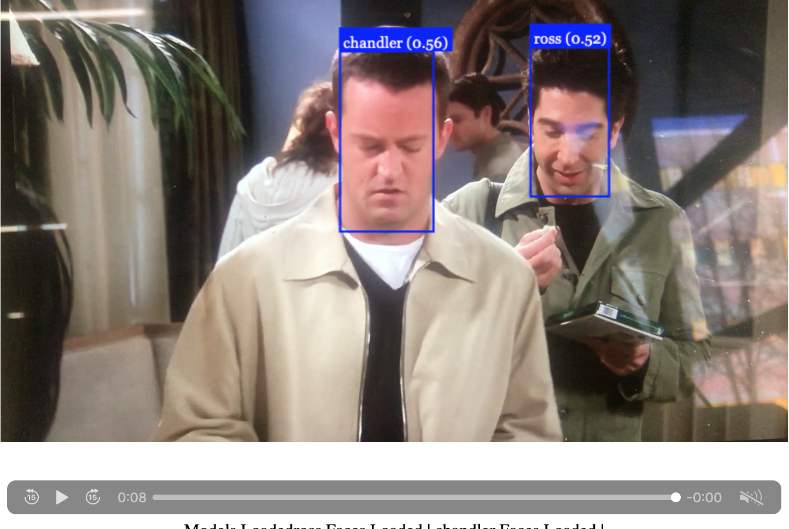

# Face-recognition-based-on-video-sources

This application uses Javascript, nodeJS and face-api.js to recognize face in videos.

Useful Links:

face-api.js:
https://justadudewhohacks.github.io/face-api.js/docs/index.html

https://itnext.io/face-api-js-javascript-api-for-face-recognition-in-the-browser-with-tensorflow-js-bcc2a6c4cf07

https://www.youtube.com/watch?v=IHkFeqvWhSw&t=3921s

